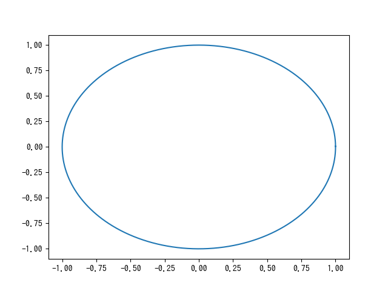
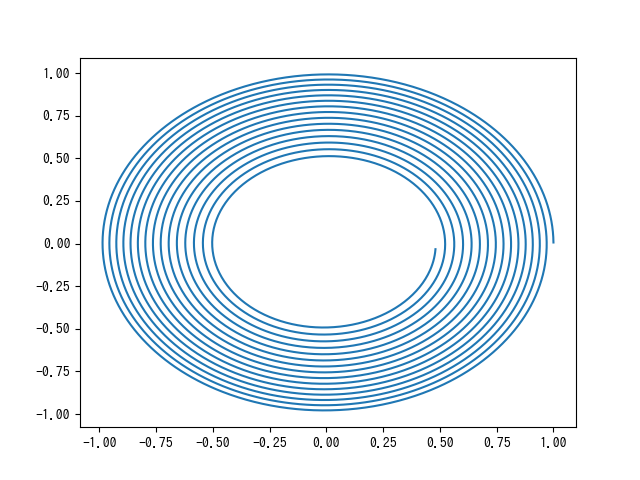
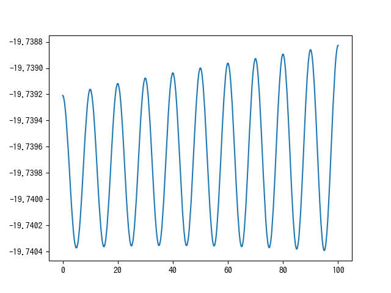
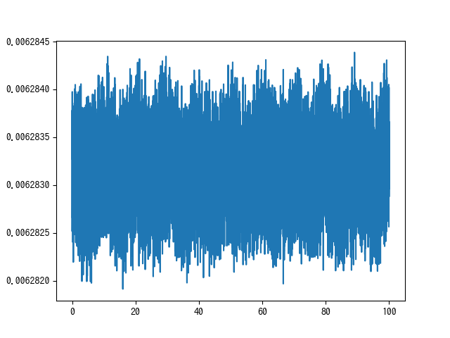
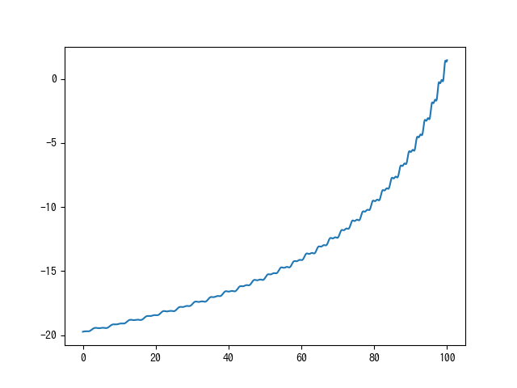
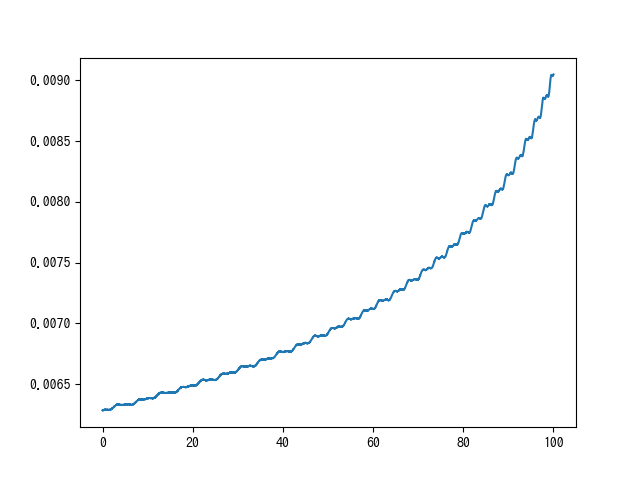

# シミュレーション理工学基礎論レポート1

<!-- ## 問題

## 問題を解くための基本事項

a. 計算対象となる現象と方程式の説明
b. 方程式から計算モデル & 計算式の導出過程の説明
c. 初期条件などの計算条件
d. プログラミングでの工夫

## 問題に対する結果および考察

a. 結果
b. 計算の妥当性の確認方法と確認結果
c. シミュレーション結果に対する考察 -->

## 問題1

## 問題を解くための基本事項

a. 計算対象となる現象と方程式の説明

### 計算対象となる現象

計算対象となる現象は「惑星の運動」である。宇宙の力学の概念を形成するために重要で、古い歴史を持つ研究分野であり、天体の運動と物体を関係づけたニュートンの運動の法則と重力の法則から力学の基礎を形成した。

### 計算対象となる方程式

計算対象となる方程式は万有引力の力を示す。次式である。

$$
F = G \frac{m m'}{r^2}
$$

万有引力とは、全ての物体の間に働く質量と質量が引き合う力のことである。2質点の間の力はそれらを結び直線に沿い、相手への向きに働く。

また、もう一つの計算対象となる方程式は運動方程式である。これは、物体の運動を決定する方程式であり、ふつう、微分方程式の形をとる。

b. 方程式から計算モデル & 計算式の導出過程の説明

### 計算モデルについて

惑星の運動の最も簡単なモデル近似として、次の条件でモデル化をした

1. 太陽と地球を質点とする。
2. 地球の軌道を二次元平面内の円軌道とする。
3. 太陽を原点に静止させる。

### 計算式の導出過程について

座標系の原点を質量Mの点である太陽に固定したときの、質量mの粒子の運動方程式は次式。

$$
m \frac{d^2 \vec{r}}{d t^2} = \vec{F} = - \frac{GMm}{r^3}\vec{r}
$$

上式を数値計算のためにデカルト座標系にて表示すると次の2式になる

$$
F_x = - \frac{GMm}{r^2}\cos{\theta} = - \frac{GMm}{r^3}x, 
F_y = - \frac{GMm}{r^2}\sin{\theta} = - \frac{GMm}{r^3}y
$$

これらを運動方程式に当てはめると、次の2式になる

$$
\frac{d^2 x}{dt^2} = -\frac{GM}{r^3}x, \frac{d^2 y}{dt^2} = -\frac{GM}{r^3}y
$$

$GM$ について考える。

惑星軌道は円形に近いので、円形に近似する。

加速度 $a$ の大きさと円軌道の半径 $r$ の関係は

$$ a = \frac{v^2}{r} $$

また、円運動している物体の加速度は常に原点方向で重力によるもの。また、 $ F = ma $ より、

$$ m \frac{v^2}{r} = \frac{GMm}{r^2} $$

式変形を行い

$$ v = {\frac{GM}{r}}^{1/2} $$

周期 $T$ と円軌道の半径の関係を考えると

$$ T = \frac{2 \pi r}{v} $$

先ほど導出した $v$ の式と上式を組み合わせることで、

$$ T^2 = \frac{4 \pi^2}{GM} \times r^3 $$

これを $GM$ について書き直すと

$$ GM = \frac{4 \pi^2 r^3}{T^3} $$ 

となり、地球の周期 $T = 1yr$, 半長軸 $a = 1AU$ の場合に

$$ GM = 4 \pi^4 $$ 

となる。したがって、プログラム中では $G, M, m, r$ の具体的な値は不要となる。

c. 初期条件などの計算条件

初期条件は次のようにした。

* $GM = 4 \pi^2$
* $a_x = a_y = 0$
* $v_x = 0, v_y = \sqrt{GM} $
* $x = 1, y = 0$

$a_x, a_y$ はそれぞれ、x, y軸方向の加速度、$v_x, v_y$ はそれぞれ x, y軸方向の速度、$x, y$ はそれぞれx, y軸の位置を表している。

d. プログラミングでの工夫

## 問題に対する結果および考察

a. 結果

1. オイラー・リチャードソン法にて計算を行った。プロットしたグラフは下記のとおりである。

2. 半ステップ法にて計算を行った。プロットしたグラフは下記のとおりである。

b-1. 計算の安定性の確認方法と確認結果

計算の安定性としては結果として添付したグラフで確認する。計算が安定しているほど、プロットされた曲線は真円を描くのみである。

オイラー・リチャードソン法の計算安定性は、定性的な判断となるが非常に高いと考える。ステップ数が10000回でほとんどぶれが存在していない。

半ステップ法の計算安定性は先ほどと同様に定性的な判断となるが低いと考える。また、オイラー・リチャードソンと比較して、円を描くというよりも渦巻きを描く状態であることから、オイラーリチャードソン法よりも半ステップ法の方が安定性は低いとわかる。

b. 計算精度の確認方法と確認結果

計算精度の安定性を確認するために、面積速度と全エネルギーについて時間ごとにプロットしたグラフを用いる。面積速度と全エネルギーは常に一定であるひつようがある。したがって、計算精度の安定性が高いほど、グラフの値にぶれがない。

面積速度として、微小単位での計算を行っているため、微小時間 $dt$ 後の座標とその前の座標の距離の差を用いた。

オイラー・リチャードソン法の面積速度を時間ごとにプロットしたグラフは次の図である。

オイラー・リチャードソン法の全エネルギーを時間ごとにプロットしたグラフは次の図である。

半ステップ法の面積速度を時間ごとにプロットしたグラフは次の図である。

上記の2つの図より、オイラー・リチャードソン法はステップを経るたびに非常に少しずつであるが徐々に計算精度の安定性が落ちていることを確認した。

半ステップ法の全エネルギーを時間ごとにプロットしたグラフは次の図である。

上記の二つの図より、半ステップ法はステップを経るたびに計算精度の安定性が落ちていくことを確認した。

c. シミュレーション結果に対する考察

オイラー・リチャードソン法の計算の安定性は常に一定であるのではなく、周期的な特徴があった。このことから、本来の円軌道は楕円形なので、モデルとして円形を用いたことに由来する問題であると考察する。

また、半ステップ法はステップを経るたびに計算の安定性・計算精度が落ちていくことを確認したが、最初の数ステップに関しては計算精度は高いことが、面積速度・全エネルギーについて時間ごとにプロットしたグラフからわかる。このことから、半ステップ法は多少の誤差を許容する場合に計算量も少ないので有効に利用することができると考える。
