# シミュレーション理工学基礎論レポート1

<!-- ## 問題

## 問題を解くための基本事項

a. 計算対象となる現象と方程式の説明
b. 方程式から計算モデル & 計算式の導出過程の説明
c. 初期条件などの計算条件
d. プログラミングでの工夫

## 問題に対する結果および考察

a. 結果
b. 計算の妥当性の確認方法と確認結果
c. シミュレーション結果に対する考察 -->

<!-- ## 必修：問題8.2

## 選択：問題8.3 -->

## 問題を解くための基本事項

a. 計算対象となる現象の説明

レナード・ジョーンズ・ポテンシャルについて説明を行う。

中性で球状の微小粒子の間の力は分子間の距離 $R$ の関数であり、$R$ が小さいと強い斥力, $R$ が大きいと引力となる。このような分子間力のポテンシャルを、レナード・ジョーンズ・ポテンシャルという。

イギリスの物理化学者レナード・ジョーンズは次式で近似的に表した。

$$
U(R) = -\frac{C_m}{R^m} + \frac{C_n}{R^n}
$$

$C_m, C_n$ は定数。

これをレナード・ジョーンズの(m, n)ポテンシャルとよび、とくに(6, 12)ポテンシャルが使われ、 次式のように変換され利用される。

$$
U(R) = U_0 \left( \left( \frac{\sigma}{R} \right) ^2 -2 \left( \frac{\sigma}{R} \right) ^6 \right)
$$

c. 初期条件などの計算条件

それぞれの粒子の初期条件については、特に指定のない限りはテキスト・資料に掲示されている $DATA$ を利用した。

## 問題8.2

### a.

プログラムmdをpython3で実装した。作成したプログラムはテキストにあるものをPython3に移植したものであるが、本プログラムではウィンドウ関連のコードまでは移植していないため、粒子の軌跡は画像として保存するようにした。

実行結果は下記のようになった。ncumが1000になるまで、処理をループさせたものである。

次, その次, さらにその次の図が、それぞれncumが1の時, 500の時, 1000の時である。

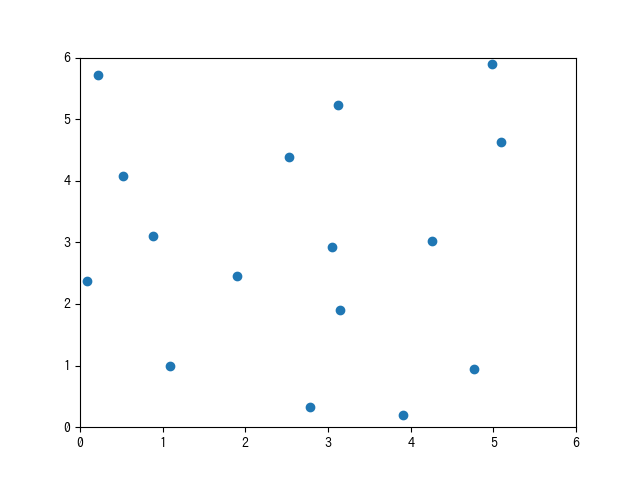
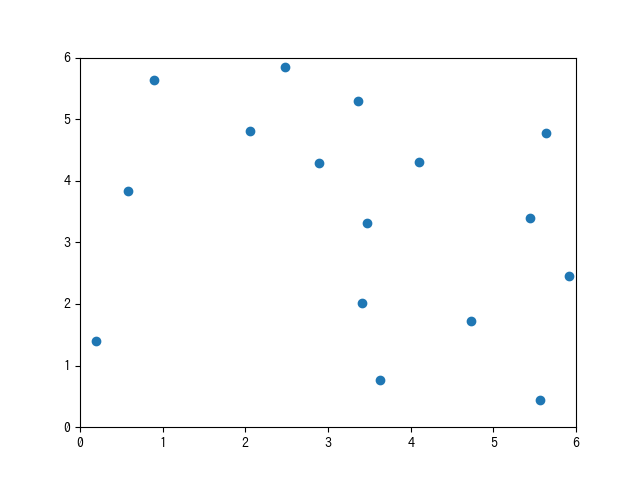
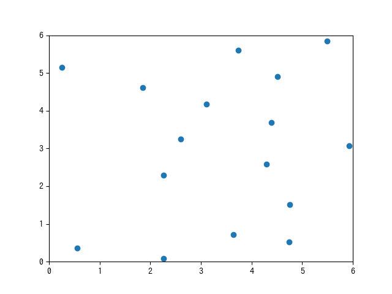

### b.

python3に移植したプログラムmdの変数の初期化をする際に

* Lx = 12
* Ly = 6

とした。

実行結果は下記のようになった。ncumが1000になるまで処理をループさせた。
次, その次, さらにその次の図が、それぞれncumが1の時, 500の時, 1000の時である。

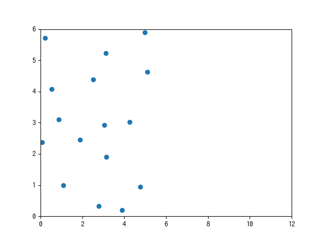
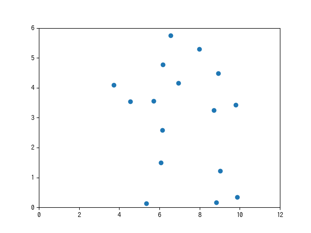

次のグラフは、問題8-2(b)を解く際に用いたプログラムを実行したときに、横軸が時間・縦軸が全エネルギーをプロットしたグラフである。赤い線は線形回帰による回帰直線である。

全エネルギーは時間によって変化しているが、回帰直線の傾きは正なので、多少は乱雑さが増したと考える。

### c.

条件を問題文に合わせて変更し、プログラムを実行した。次のグラフは縦軸にセルの左半分に居る粒子の数n(t), 横軸に時間tをプロットした図である。赤線は回帰直線である。

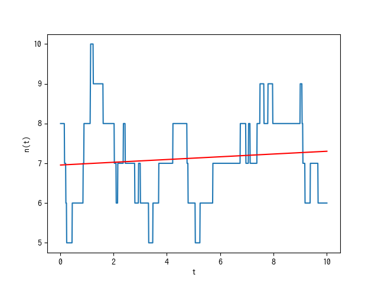

次のグラフは縦軸に左半分にいる粒子の数n(t)の時間平均、横軸に時間tをプロットした図である。

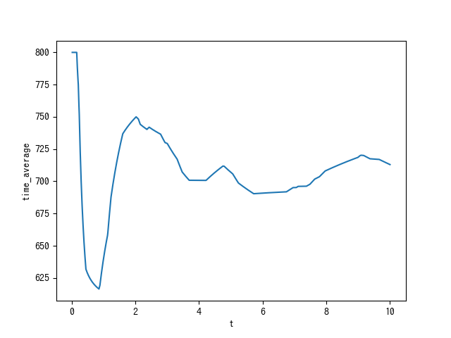

n(t)のグラフは定性的には、7を中心に増減が激しい。左半分の粒子数は7であると考える。その根拠として、n(t)の回帰直線が7付近であるからである。

## 問題8.3

### a.

条件を問題文に合わせて変更し、プログラムを実行した。次のグラフは縦軸にセルの左半分に居る粒子の数n(t), 横軸に時間tをプロットした図である。赤線は回帰直線である。

上図から、n(t)が時間の経過により一定に収束することなく振動していることがわかる。このことから、系は平衡に達しないことがわかる。また、その理由は、初期状態としてy軸方向の速度を持つ粒子が無いことから、y軸方向の加速度に変化がなく、その結果y軸方向に粒子が移動しないからであると考える。

### b.

条件を問題文に合わせて変更し、プログラムを実行した。次のグラフは縦軸に左半分にいる粒子の数n(t)の時間平均、横軸に時間tをプロットした図である。

次のグラフは縦軸にセルの左半分に居る粒子の数n(t), 横軸に時間tをプロットした図である。赤線は回帰直線である。

系の定性的な振る舞いは設問aの場合と異なる。また、系は最終的に平衡に達する。そして、全ての粒子の軌跡は初期状態について敏感であると考える。

系が平衡に達すると考える理由として、n(t)の時間平均のグラフが収束しているからである。また、すべての粒子の軌跡が初期状態について敏感である理由として、一つの粒子の初期状態を変化させただけで、系は平衡に達するからである。

### c.

問題文に合わせて条件を変更した。また、tが0.5になったときに全ての速度を反転させ、tが1.0になるまでループさせた。

初期状態を示すのが次の図である。

最終状態を示すのが次の図である。

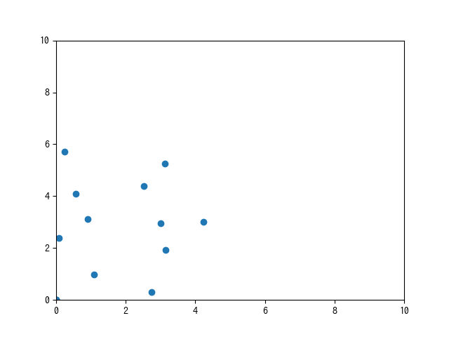

計算の多少の差はあるが、全ての粒子は元の位置に戻っていることが確認できる。

次に、tが1.0になったときに全ての速度を反転させ、tが2.0になるまでループさせた。

初期状態を示すのが次の図である。

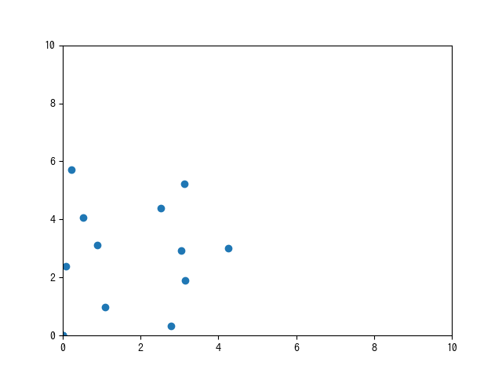

最終状態を示すのが次の図である。

この場合も先ほどと同様に、全ての粒子は元の位置に戻っていることが確認できる。

次にdtを元の0.01から0.001にし、tが0.5になったときに全ての速度を反転させ、tが1.0になるまでループさせた。初期状態と最終状態は次の2図のとおりである。

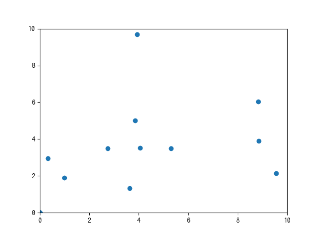

以上の図からdtを小さくしても、全ての粒子は元の位置に戻っていることが確認できた。

最期に、dtを元の0.01から0.001にし、tが1.0になったときに全ての速度を反転させ、tが2.0になるまでループさせた。この時の初期状態と最終状態は次の2図のとおりである。

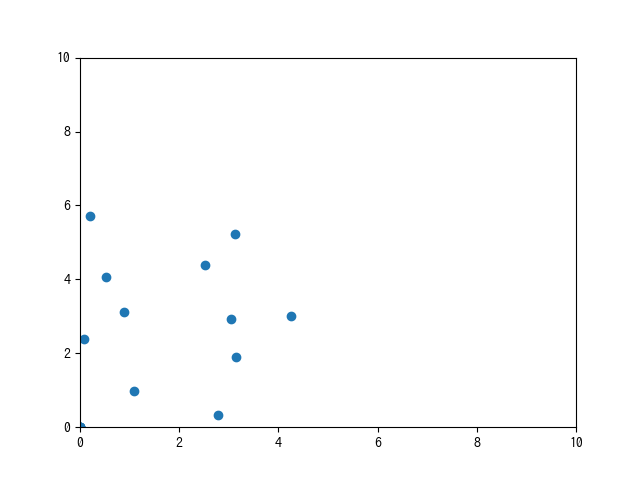

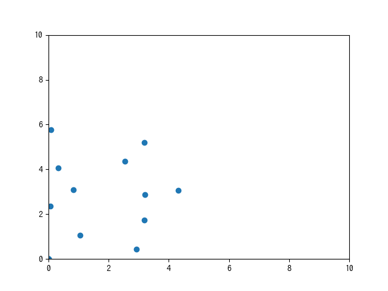

以上の図からdtを小さくしても、全ての粒子は元の位置に戻っていることが確認できた。また、dtが小さい方がより正確に元の位置に戻ることがわかった。
